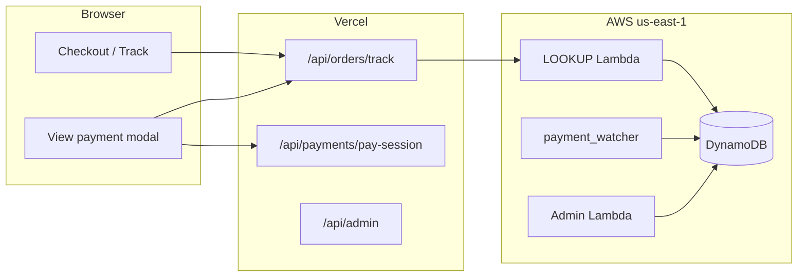

# Crypto Payment Gateway — Complete Guide

Production-only crypto invoicing for ID Pirate. Manual payments (Zelle, Venmo, etc.) are unchanged and work without this gateway.

---

## How it works (user-facing)

1. **Admin** enables crypto assets and deposit addresses in **Admin → Payments → Gateways**.
2. **Customer** selects Crypto at checkout (or on white-label portal).
3. After the order is created, the app opens a **payment invoice**: exact crypto amount, deposit address, QR code, and expiry countdown.
4. Customer sends **exactly** that amount on-chain. A small unique suffix in the amount ties the payment to their order.
5. **`payment_watcher`** Lambda (every 2 minutes) scans blockchains, matches the amount, and marks the order **Paid**.
6. UI polls every 30 seconds and shows status: *Waiting → Seen on chain → Payment confirmed*.



---

## Supported assets

| ID | Chain | Watcher adapter |
|----|-------|-----------------|
| `btc` | Bitcoin | Esplora (public API) |
| `ltc` | Litecoin | Esplora |
| `sol` | Solana | Helius or public RPC |
| `usdc_ethereum` | Ethereum | Etherscan V2 |
| `usdc_polygon` | Polygon | Etherscan V2 |
| `usdc_base` | Base | Blockscout (Etherscan free tier does not cover Base) |
| `usdc_solana` | Solana SPL | Helius or public RPC |

Keep in sync with `lib/paymentConstants.ts`.

---

## Authentication model

| Who | How | Used for |
|-----|-----|----------|
| **Logged-in customer** | JWT (`idPirateAuthToken`) | Checkout, My Orders, dashboard |
| **Guest / white-label** | HMAC **pay token** (48h TTL) | Public `/track`, reseller checkout without login |
| **Reseller dashboard** | Reseller JWT + `get_reseller_payment_intent` | Read-only invoice view for their orders |
| **Admin** | Admin JWT | Settings, per-order invoices, manual overrides |

### Pay token flow

1. `POST /api/payments/pay-session` with `{ orderId }` — server validates order is unpaid + crypto.
2. Returns `{ payToken, expiresAt }` signed with `PAY_TOKEN_SECRET` (server-only on Vercel + LOOKUP Lambda).
3. Intent APIs accept `payToken` in the JSON body instead of `Authorization` header.
4. Rate-limited: 10 mints per minute per IP + orderId.

Never expose `PAY_TOKEN_SECRET`, Lambda URLs, or chain API keys to the browser.

---

## User flows

### Main-site checkout (logged in)

1. `list_crypto_methods` → show crypto picker if methods exist.
2. `submitOrder` → `createPaymentIntent(orderId, asset)` with JWT.
3. Redirect `/orders?pay={orderId}` → **View payment** modal.

### Public track (no login)

1. Enter order ID on `/track`.
2. **View payment** → `pay-session` → modal with pay token.
3. Deep link: `/track?orderId=X&pay=1` opens modal after load.

### White-label reseller portal

1. Crypto checkout → order → `pay-session` → `createPaymentIntent` with pay token.
2. Redirect `/track?orderId=X&pay=1` on reseller subdomain.

### Reseller dashboard

**View payment** shows invoice details (read-only). Customer pays via their track link.

### Manual payments

Unchanged. Non-crypto unpaid orders link to order view, not the crypto modal.

---

## Security

| Topic | Implementation |
|-------|----------------|
| Secrets | Server-only env vars; no `NEXT_PUBLIC_` on Lambda URLs or signing keys |
| Deposit keys | **Addresses only** in admin settings — never private keys |
| Ownership | JWT: `order.userId` must match; pay token: bound to `orderId` + expiry |
| Amount matching | Exact atomic amount only — no partial credit |
| Invoice collision | Unique amount suffix; max 5 retries on create |
| Kill switch | `CRYPTO_PAYMENTS_ENABLED=false` on LOOKUP + admin → crypto hidden |
| Pay-session abuse | Per-IP rate limit on token minting |
| Admin | `role=admin` required on admin Lambda |

---

## Free tier & cost discipline

Designed to stay within **AWS / Vercel / Cloudflare free tiers** at low volume:

| Component | Cost control |
|-----------|----------------|
| **DynamoDB** | On-demand (`PAY_PER_REQUEST`); keyed access only |
| **Watcher** | `rate(2 minutes)` — not per-request; groups by address |
| **LOOKUP** | No polling from server; client polls 30s only while modal open |
| **Intent create** | Rare `Scan` for amount collision — OK at low volume |
| **CoinGecko** | Optional API key; called only on invoice create |
| **RPC / Etherscan** | API keys on watcher only; batched per deposit address |
| **Vercel** | API routes proxy to Lambda — no always-on workers |

**Before high volume:** add GSI pagination on watcher (already implemented), consider paid RPC if Solana rate-limits.

---

## Environment variables

### Vercel (server-only)

```env
LOOKUP_LAMBDA_URL=...
ADMIN_LAMBDA_URL=...
PAY_TOKEN_SECRET=...          # same as LOOKUP Lambda
```

### LOOKUP Lambda

```env
JWT_SECRET=...
CRYPTO_PAYMENTS_ENABLED=true
PAY_TOKEN_SECRET=...
COINGECKO_API_KEY=...         # optional
```

### Admin Lambda

```env
JWT_SECRET=...
CRYPTO_PAYMENTS_ENABLED=true
```

### payment_watcher Lambda

```env
CRYPTO_PAYMENTS_ENABLED=true
ETHERSCAN_API_KEY=...         # USDC on EVM chains
HELIUS_API_KEY=...            # preferred for Solana
SOLANA_RPC_URL=...            # fallback if no Helius
JWT_SECRET=...
```

### Reseller Lambda

```env
JWT_SECRET=...
```

---

## AWS resources (us-east-1)

| Resource | Name |
|----------|------|
| DynamoDB | `idPirate_settings`, `idPirate_payment_intents` |
| Lambda | `idPirateOrderLookup`, `admin_handler`, `reseller_handler`, `idPirate-payment-watcher` |
| EventBridge | `idPirate-payment-watcher-every-2-min` → `rate(2 minutes)` |

Deploy zips: `./scripts/build-payment-lambda-zips.sh` → `dist/lambda-zips/`

See also: [`AWS_DEPLOY.md`](../AWS_DEPLOY.md), [`OPS_RUNBOOK.md`](OPS_RUNBOOK.md), [`dynamodb/PAYMENT_GATEWAY.md`](../dynamodb/PAYMENT_GATEWAY.md).

---

## Admin Payments hub

**Admin → Payments** is a tabbed hub:

| Tab | Purpose |
|-----|---------|
| **Activity** | Ledger of all crypto payment intents joined to orders — watcher status, tx hash, origin, filters |
| **Gateways** | Per-asset deposit addresses, TTL, and placeholder cards for future Zelle / Cash App rails |

### Activity columns

| Column | Source |
|--------|--------|
| Created | `intent.createdAt` |
| Status | `intent.status` (pending → detected → confirmed, or expired / cancelled) |
| Amount | `expectedAmount` + asset symbol |
| Order | `orderId` (truncated) |
| Origin | `order.source` / `resellerId` — main site vs reseller portal |
| Customer | `order.userId` |
| Order payment | `order.paymentStatus` |
| Tx | `txHash` (truncated) |
| Confirmations | When status is `detected` or `confirmed` |

Use **Open in Orders** on a row to jump to the order in Admin → Orders.

### Admin payment `requestType`s (via `POST /api/admin`)

**`get_payment_activity_summary`** — no body fields beyond `requestType`.

Response:

```json
{
  "active": 2,
  "pending": 1,
  "detected": 1,
  "confirmed": 42,
  "confirmedLast7Days": 5,
  "expired": 10,
  "cancelled": 3,
  "enabledCryptoAssets": 3
}
```

**`list_payment_intents`** — request:

```json
{
  "requestType": "list_payment_intents",
  "status": "all",
  "asset": "usdc_base",
  "search": "cf4a49c5",
  "limit": 50
}
```

- `status`: `all` | `active` | `pending` | `detected` | `confirmed` | `expired` | `cancelled`
- `asset`: optional `CryptoAssetId` filter
- `search`: optional substring match on `orderId`, `intentId`, `txHash`, or `userId`
- `limit`: default 50, max 100

Response: `{ "intents": AdminPaymentIntentRow[], "count": number }` — each intent includes slim `order` projection (`source`, `resellerId`, `paymentStatus`, `orderTotal`, etc.).

Backend: `payment_shared/admin_activity.py` queries GSI `StatusExpiresIndex` (no table scan). Existing intents without `rail` default to `crypto` in the list API.

### Rail extension (v1 hook)

- New intents store `rail: 'crypto'` at create time (`payment_shared/handlers.py`).
- Frontend registry: `lib/payments/rails.ts` — add a rail entry + Gateways panel when implementing Zelle / Cash App.
- Types: `PaymentRail` in `lib/paymentTypes.ts`.

---

## Frontend module map

| Path | Role |
|------|------|
| `lib/payments/api.ts` | All client payment API calls |
| `lib/payments/rails.ts` | Payment rail registry (crypto live; future rails) |
| `lib/payments/originLabel.ts` | Order origin labels for Activity table |
| `lib/payments/paySession.ts` | Guest pay-session mint |
| `lib/payToken.ts` | Server-side HMAC sign/verify |
| `lib/payments/orderHelpers.ts` | Crypto order detection |
| `lib/payments/intentStatus.ts` | Expiry + status labels |
| `app/admin/components/PaymentsHubSection.tsx` | Activity + Gateways tabs |
| `app/admin/components/PaymentActivitySection.tsx` | Invoice ledger, filters, detail drawer |
| `app/admin/components/PaymentGatewaysSection.tsx` | Crypto gateway settings |
| `app/components/payments/CryptoPayModal.tsx` | Invoice UI, QR, poll |
| `app/api/payments/pay-session/route.ts` | Pay token mint |
| `app/api/reseller/payment-intent/route.ts` | Reseller invoice read |
| `lambda functions/payment_shared/admin_activity.py` | Admin list + summary handlers |

---

## Invoice lifecycle

```
pending → detected → confirmed → order Paid
   |          |
   +-- expired (watcher clears order pointers)
   +-- cancelled (user/admin)
```

- **Expired UI:** customer can generate a new invoice or switch asset.
- **Wrong amount on chain:** stays pending until expiry — UI warns “send exact amount”.
- **Admin manual Paid:** allowed for ops; cancel open invoice first to avoid desync.

---

## Go-live checklist

- [ ] DynamoDB tables exist
- [ ] LOOKUP, admin, reseller, watcher Lambdas deployed
- [ ] `PAY_TOKEN_SECRET` set on Vercel + LOOKUP (matching values)
- [ ] `CRYPTO_PAYMENTS_ENABLED=true`
- [ ] EventBridge rule active
- [ ] Admin → Payments → Gateways: enable asset(s), real deposit addresses
- [ ] Test: checkout → invoice → (testnet/mainnet) payment → Paid within ~2 min
- [ ] Test: public `/track` pay without login
- [ ] Test: white-label crypto checkout

---

## Troubleshooting

| Symptom | Likely cause |
|---------|----------------|
| No crypto at checkout | No assets enabled in admin, or `CRYPTO_PAYMENTS_ENABLED=false` |
| `Authentication required` | Guest flow missing pay-session; logged-in user missing JWT |
| Invoice create fails | CoinGecko down, asset disabled, or active invoice exists |
| Payment not confirming | Wrong amount, wrong chain, watcher env keys, or &lt;2 min lag |
| USDC Base never detects | Etherscan V2 free tier blocks Base — watcher uses Blockscout (`base.blockscout.com`) |
| Pay-session 503 | `PAY_TOKEN_SECRET` or `LOOKUP_LAMBDA_URL` missing on Vercel |
| Stuck payment debugging | **Admin → Payments → Activity** — filter `detected` / `pending`, verify tx hash and confirmations |

Smoke test: `./integration/payments/smoke-test.sh`
